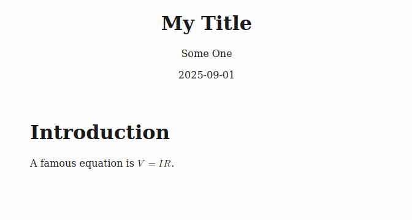

### Goals

The goals for this quick tutorial are to:

* Case 1: show how to leverage existing LaTeX source documents and experience
* Case 2: introduce Markdown for simple accessible authoring targeting html, docx/pptx, and epub
* Case 3: introduce ConTeXt for producing accessible PDFs
* Case 4: introduce Quarto for more complex accessible authoring

It assumes you are already using a Markup language to author your documents (or want to learn how).

See this [GitHub repository](https://github.com/clwyatt/accessibility-templates) for templates and the source for this presentation.

### Case 1: Basic LaTeX to Accessible HTML + MathML

Given ``mydoc.tex``:

```{.latex}
\documentclass{article}
\title{My Title}
\author{Some One}
\date{2025-09-01}
\begin{document}
\maketitle

\section{Introduction}

A \textbf{famous} \textit{equation} is $V = IR$.

\end{document}
```


### Case 1: Basic LaTeX to Accessible HTML + MathML

We can use [pandoc](https://pandoc.org) to convert this to a single accessible html file.

```{.sh}
> pandoc -s -t html -V lang=en --embed-resources --mathml mydoc.tex -o mydoc.html
```

* ``-s`` create a standalone html file (header etc)
* ``-t html`` means to produce html
* ``-V lang=en`` adds the language to the html header (for screen readers)
* ``--embed-resources`` embeds any resource files (e.g. images) into the file itself. This makes it easier to distribute and upload to Canvas but increases file size.
* ``--mathml`` means to use mathml for math. This results in equations a screen reader can automatically navigate.

### Case 1: Basic LaTeX to Accessible HTML + MathML

The [result](output/mydoc.html) gets 100% in Ally and Firefox Accessibility Issue tool.



### Case 1: Adding Images with Alt Text

Suppose we add to ``mydoc.tex``:

```{.latex}
\includegraphics[alt={As long a description as you like}]{myfig.png}
```

The [html output](output/mydoc-v2.html) now includes the image with accessible alt text.

### Case 1: Adding Captions

Suppose we modify ``mydoc.tex``:

```{.latex}
\begin{figure}
  \centering
  \includegraphics[alt={illustration of concept X, 
                        see figure caption for details
						}]{myfig.png}
  \caption{My longer caption text with details.}
\end{figure}
```

The [html output](output/mydoc-v3.html) includes the image with accessible alt text with a visible caption. This is the recommended practice for complex images.

### Case 1: More complex math

Pandoc conversion supports the amsmath and amssymb LaTeX packages.

Example preamble:

```{.latex}
\usepackage{amsmath,amssymb}
```

Example usage:
```{.latex}
\begin{align*}
  a_k &= \frac{1}{T_0} \int\limits_{T_0} x_p(t) e^{-jk\omega_0 t}\; dt\\
  &= \frac{1}{T_0} \int\limits_{-\infty}^{\infty} x(t) e^{-jk\omega_0 t}\; dt \mbox{ since } x(t) = 0 \mbox{ outside the interval } (A,B)\\
\end{align*}
```

Again, the [result](output/mydoc-v4.html) gets 100% in Ally and Firefox Accessibility Issue tool.

### Case 1: Tikz figures

If you use ``tikz`` or ``circuitikz`` for figures, render them to svg and include them.

[Here are some examples](https://github.com/clwyatt/ece3704-notes) showing how to combine all these options.

### Case 1: EPUB output

* One of the problems with html is external resource files like images
* The `--embed-resources` option to pandoc mitigates this, but generates large files in some cases (it has to uuencode binary files).
* Another option is to use zip files, one per document, or a mhtml file.
* A better option is to use the epub format, which is a zip file of html, images, and metadata. It is considered accessible if you use alt-tags.

```{.sh}
pandoc -s -t epub --mathml input.tex -o output.epub
```

There are many readers available including Calibre and Adobe Digital Editions.

### Case 1: LateX Beamer

If you use beamer for your slides. You can convert to one of the html slide frameworks, e.g. reveal.js using pandoc.

See [this example](https://github.com/clwyatt/accessibility-templates/tree/main/beamer-to-html).

### Case 2: Using Markdown

If you do not currently use LaTeX, consider Markdown.

* simple markup, but supports sections, math, and figures
* pandoc can generate accessible html, epub, or docx/pptx (with the proper structure)
* pandoc can also generate accessible PDF (with some effort via ConTeXt)

[Here is an example](https://github.com/clwyatt/accessibility-templates/tree/main/markdown-to-html-pdf-docx)

### Case 3: Using ConTeXt

* The html+mathml format should be preferred, but sometimes we need to preserve layout and prevent tampering (e.g. for assignments).
* LaTeX does not currently support tagged PDF (at least that I can get to work)
* A very similar macro system for TeX, called ConTeXt, does support tagging.
* I am using this to generate homework with and without solutions from the same source file.
* Can be used in conjunction with Markdown if you do not want to learn ConTeXt (however, the basics are easy). 

It can be tricky to install but if you are interested, let me know.

### Case 4: Using Quarto

A final example, if you need to generate more complex documents with multiple pages, cross-references, etc. consider using the Quarto publishing system.

* Uses a markdown syntax
* supports multiple document types including html and epub
* integrates computation (python scripts, etc) that produce output embedded in the document

I am using this to [convert the ECE 2714 Notes](https://github.com/clwyatt/notes-2714).

### Some Takeaways

* Consider moving away from PDF, html+mathml is much more accessible
* Tag every image
* Start small, one document at a time
* Pandoc is your new best friend

#### Resources

* <https://pandoc.org>
* <https://quarto.org>
* <https://wiki.contextgarden.net>


